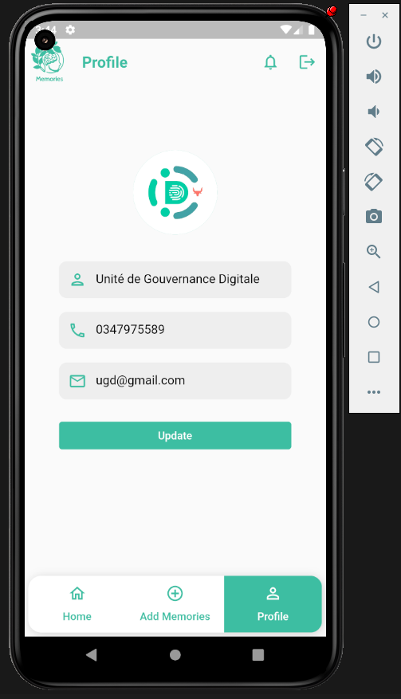

# Theme : Memories

# Fonctionnalités

- Inscription et Connexion : Les utilisateurs peuvent créer un compte et se connecter à l'application à l'aide d'informations d'identification.

- Profil utilisateur : Les utilisateurs peuvent gérer leur profil, ajouter une photo, mettre à jour leurs informations, et consulter leurs articles publiés.

- Publication d'articles : Les utilisateurs peuvent créer, éditer et supprimer leurs propres articles. Ils peuvent ajouter du texte, des images.

- Liste d'articles : Une liste d'articles est affichée dans l'application, triée par date de publication.

- Commentaires : Les utilisateurs peuvent commenter les articles, lire les commentaires et interagir avec les autres utilisateurs.
- Intégration de la recherche en temps réel pour les articles via l'API
- Stockage des données : Base de données relationnelle MySQL pour stocker les utilisateurs, les articles, les commentaires, J'aime.
- Système de likes

# Coté developpement

- Utilisation d'une architecture MVVM (Modèle-Vue-VueModèle) pour la structure du code (Flutter 3.10.6)
- Utilisation de l'API Laravel Framework 10.17.0 pour obtenir les données des articles

# Requis
- Dart SDK version: 3.0.6
- Flutter 3.10.6
- Laravel 10 requires a minimum PHP version of 8.1.
# Screenshots

